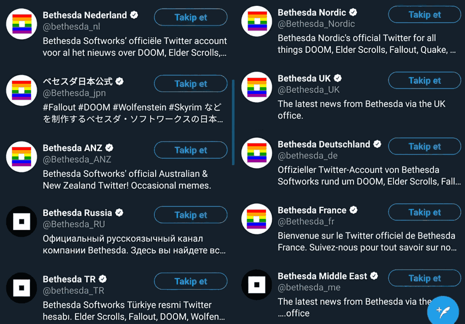

## NostraDavid; the author

I'm someone who's sick of the state of the web and you know what they say:

> Improve the world, start with yourself - [Bond Zonder Naam](https://nl.wikipedia.org/wiki/Bond_zonder_Naam)

This is why I started with the basics: HTML, CSS and JS. Anything else is deemed _bloat_

## Thaumatorium

### The name

It's based on the word _thaumaturge_, meaning _miracle worker_, thus _Thaumatorium_ is where miracles are performed.

### The reason - the why

I wanted a place where I could post my articles, but I found my free [Wordpress site](https://thaumatorium.wordpress.com/) too slow, too bloated, too messy, so I started to search for a way to still create and host articles, without needing bloat like Wordpress.

I started with thinking about using something like Angular and React. They were the hot new thing in town, so why not try that? Turns out they both have a tendency to become pretty damn complex pretty damn fast - that's my personal experience anyway.

After finding Elm, a Haskell-like language that compiles to JS I though to use that as it promised small and (more importantly) _fast_ websites.

After learning the creator wasn't the... most cooperating of persons I decided to move on before even clashing with him.

I quickly found the Blazor beta, which seemed promising, especially in the PWA department. Downsides: the output is rather huge (4MB+ in size) and the code is based on the Mono lib, not the fastest of libs.

So I ended up thinking: What's left after removing _all and anything_ bloat? HTML. CSS. JS... So why not create my site in that? So I set out to create a PWA - a single HTML page that contains the whole site.

The site quickly grew too big for this, so I changed it up by splitting the site in separate HTML pages, but index.html contained the generic header/footer HTML, while the other HTML files contained the articles.

In doing so - splitting the site, but mostly handling things like a PWA - I broke the back/forward buttons and browser history...

In the end I decided in writing just separate HTML pages, which means I have a bunch of duplicate HTML, but I'm OK with that, as I know enough REGEX to edit _all_ HTML headers in one fell swoop!

### What else

I'm pretty fucking sick of all the political bullshit/polarisation I see online, so miss me with that shit.

That is why on my future news aggregator I'm completely forbidding that bullshit.

There's a lot more that I'm going to forbid, but I think that's one of the big ones - one you _don't_ see on other sites, unlike the stereotypical "no racism, hate, etc" virtue signalling bullshit.

Yes, I also hate Virtue Signalling month of June. LGBT all of a sudden matters to giant corporations. Corporations that don't give a fuck about the places where it _actually_ matters:

The source of this image is [@RudyHavenstein](https://twitter.com/RudyHavenstein/status/1275833222170107904)

I fucking loathe hypocritical behavior like that. They're basically lying to their western customers, acting as if they're doing good, while only changing the icon in the place that already legally and socially accept LGBT humans.

Ooh! I got another thing: The New York Times is now going to [Uppercase the word Black](https://www.nytco.com/press/uppercasing-black/), because that's truly what black Americans care about...

They want the USA police to not be trash and to stop killing them, you stupid fucking cunts. They don't give a fuck you're uppercasing the word 'Black'.

Right-wing extremists may have taken over the 'clown world' meme, but sometimes I truly believe we live in a fucking clown's world 🤡 HONK HONK, MOTHERFUCKERS!

Anyway, I'm thinking about banning Americans from my site too. I'm not going to accept people who are retarded. People with mental disabilities are still welcome, ofcourse.

I'm also just so fucking done with racist shitheads that think it's OK to act racist against white humans, because they are part of some minority – I'm looking at you WaPo, hiring Sarah Jeong and Karen Attiah. Fuck you too.

PS: The definition of the word "Racism" is NOT "power + prejudice". That's a bullshit definition that should stay in the trashheap that is sociology. I'll fucking yeet you from my site if you pull that shit on people too.

PPS: Right-wingers may now start to get the idea I'm /their guy/. I'm not. Stop being obnoxious retards and get your shit together. Please.

### The cure

Great minds discuss ideas, average minds discuss events, small minds discuss people. – Eleanor Roosevelt

We (the internet at large) are too busy with discussing people, not even events. I want to see the internet move _back_ to discussing ideas. That was more the case on Reddit back in the days - [Reddit on 2008-12-29](https://web.archive.org/web/20081229163556/https://reddit.com/) was much more about ideas, not events or people.

The normies have invaded the internet. That's not necessarily bad, but what is is that they came in such numbers they did not need to adapt to our netizenship and changed our internet culture. _For the worse_, mind you. I hope to one day have enough influence to change that, for the betterment of humanity.

### Linguistic Cleansing pisses me the fuck off

More virtue signalling, this time coming out of the Linux community...

> avoid introducing new usage of 'master / slave' (or 'slave' independent of 'master') and 'blacklist / whitelist'

[source](https://www.kernel.org/doc/html/latest/process/coding-style.html#naming)
