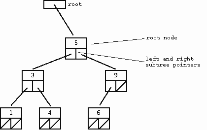
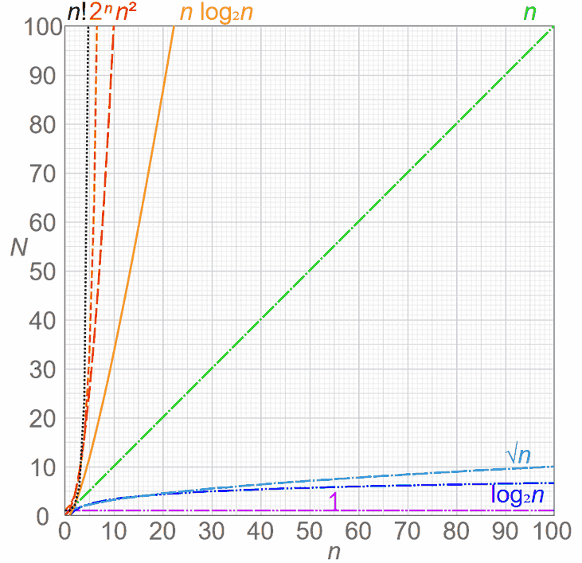

## Disclaimer

I'm not a mathematician, so this won't be exact, but I'll try to give you an intuitive understanding of Big O.

Big O (usually written as _O(x)_, where _x_ is a mathematical equation like _1_, _n_, _n²_, or _2ⁿ_, for example)
describes _how quickly the amount of work grows when the amount of input grows._

In beginner explanations this is often treated like "how bad can it get?", and that's usually good enough to build
intuition.

## What Big O Ignores

Big O is about the _shape of the growth_, not the exact number of steps. That means constants and smaller terms get
ignored.

For example, if an algorithm takes _2n + 3_ steps, we still write it as _O(n)_. If it takes _n² + n_ steps, we write it
as _O(n²)_.

The reason is simple: when _n_ becomes very large, the biggest-growing part dominates the rest.

## Example 1: Constant Time - O(1)

If you have an array or list and want to look up the nth item, it will maximally take a so-called "constant time",
expressed as _O(1)_. This does not mean it literally takes one step, but it means that no matter how many items you have
in your data structure, the number of steps it takes to retrieve the nth item is always a constant amount (whether it's
actually 1 step or 10 does not matter in practice).

```python
value = items[5]
```

## Example 2: Logarithmic Time - O(log n)

A lookup in a _balanced binary search tree_ takes _O(log n)_ steps. You can eliminate half of the remaining options at
each step, just like with binary search.



_Image sourced from [Stanford's Binary Trees](http://cslibrary.stanford.edu/110/BinaryTrees.html)_

Note that you may execute a few constant steps before that (like creating a variable to save the answer in), but since
_O(log n)_'s runtime overshadows any _O(1)_ code, we only note the _O(log n)_ part.

```text
Check the middle
Then half of what remains
Then half again
Then half again...
```

## Example 3: Linear Time - O(n)

If you want to find whether your array or list contains a certain item (assuming it's an unsorted list), it will take
_O(n)_ steps, because each item has to be checked once to see if it's the item you're looking for.

If you have a list with 10 items and the last item is the one you're looking for, it will take 10 steps. This represents
the _worst case_ scenario: Big O describes _how many steps an algorithm **maximally** will take to run._

If your algorithm has a part that happens to be _O(1)_ or _O(log n)_, you still note it down as _O(n)_, because _O(n)_
overshadows the runtime of _O(1)_ and _O(log n)_.

```python
for item in items:
    if item == target:
        return True
```

## Example 4: Quadratic Time - O(n²)

If you have a nested loop, where for each element you go through all elements again (like in bubble sort), it will take
_O(n²)_ steps. This is because for each of the n elements, you perform n operations.

For example, if you have a list of 10 items, it might take up to 100 steps to complete.

```python
for x in items:
    for y in items:
        do_something(x, y)
```

## Example 5: Exponential Time - O(2ⁿ)

Some algorithms, like the naive recursive Fibonacci implementation, take _O(2ⁿ)_ time. This means the amount of work
roughly doubles with each extra step of input.

For example, with 10 items, it could take up to 1024 steps.

```python
def fib(n):
    if n <= 1:
        return n
    return fib(n - 1) + fib(n - 2)
```

## Most Common Big O Notations

Now that you understand the basics, here's a simplified list of possible Big O expressions, sorted from shortest to
longest runtime. The _**bold-italic**_ rows are the most common.

| Notation               | Name                                                                                                 | Example                                                     |
| ---------------------- | ---------------------------------------------------------------------------------------------------- | ----------------------------------------------------------- |
| _**O(1)**_             | [Constant](https://en.wikipedia.org/wiki/Constant_time)                                              | Array lookup like `list[2]`                                 |
| O(log log n)           | [Double Logarithmic](https://en.wikipedia.org/wiki/Double_logarithm)                                 |                                                             |
| _**O(log n)**_         | [Logarithmic](https://en.wikipedia.org/wiki/Logarithmic_time)                                        | Lookup in a sorted binary tree                              |
| O((log n)ᶜ)            | [Polylogarithmic](https://en.wikipedia.org/wiki/Polylogarithmic_time)                                |                                                             |
| O(nᶜ), where 0 < c < 1 | [Fractional Power](https://en.wikipedia.org/wiki/Computational_complexity_theory#Complexity_classes) | Rare, but grows slower than O(n)                            |
| _**O(n)**_             | [Linear](https://en.wikipedia.org/wiki/Linear_time)                                                  | For-loops                                                   |
| O(n log n) = O(log n!) | [Linearithmic or Quasilinear](https://en.wikipedia.org/wiki/Linearithmic_time)                       | Merge sort, quicksort                                       |
| _**O(n²)**_            | [Quadratic](https://en.wikipedia.org/wiki/Quadratic_time)                                            | Bubble sort, nested loops, insertion sort in the worst case |
| O(nᶜ), where c > 1     | [Polynomial](https://en.wikipedia.org/wiki/Polynomial_time)                                          | Matrix multiplication                                       |
| O(2ⁿ)                  | [Exponential](https://en.wikipedia.org/wiki/Exponential_time)                                        | Naive recursive Fibonacci                                   |
| O(n!)                  | [Factorial](https://en.wikipedia.org/wiki/Factorial)                                                 | Brute-force solutions                                       |

For the full table: [Wikipedia - Big O
Notation](https://en.wikipedia.org/wiki/Big_O_notation#Orders_of_common_functions)

Another great article: [Wikipedia - Time Complexity](https://en.wikipedia.org/wiki/Time_complexity)

## Best, Average and Worst Case

One thing that can confuse beginners: the same algorithm can behave differently depending on the input.

For example, insertion sort is often listed as _O(n²)_, which is true in the worst case, but if the list is already
almost sorted it can behave much better.

So when you see a Big O value, always ask yourself: is this the best case, the average case, or the worst case?

## Visually Speaking

Anything _superlinear_ deserves attention, especially when the input can become large. That said, _O(n log n)_ is often
perfectly fine in practice, and sometimes even the best you can realistically do.

You can see why avoiding anything greater than _O(n)_ is essential here, as the rate of growth increases dramatically:



_Source: [Comparison Computational
Complexity](https://en.wikipedia.org/wiki/Time_complexity#/media/File:Comparison_computational_complexity.svg)_

## A Bit of Trivia

There's a concept in mathematics called _P=NP_, which questions whether every problem whose solution can be quickly
verified can also be quickly solved. For instance, verifying a Sudoku solution is quick, but solving it is not.

This problem is currently unsolved in Computer Science, so maybe (if you're smarter than me) you can solve it in the
future.

## Closing Words

I hope this short intro into Big O has been helpful to you. 😊

PS: Note that there are other asymptotic notations (like little-o, Big-Omega, little-omega, and Theta). These represent
different aspects of algorithm performance, but that's outside the scope of this tutorial.
