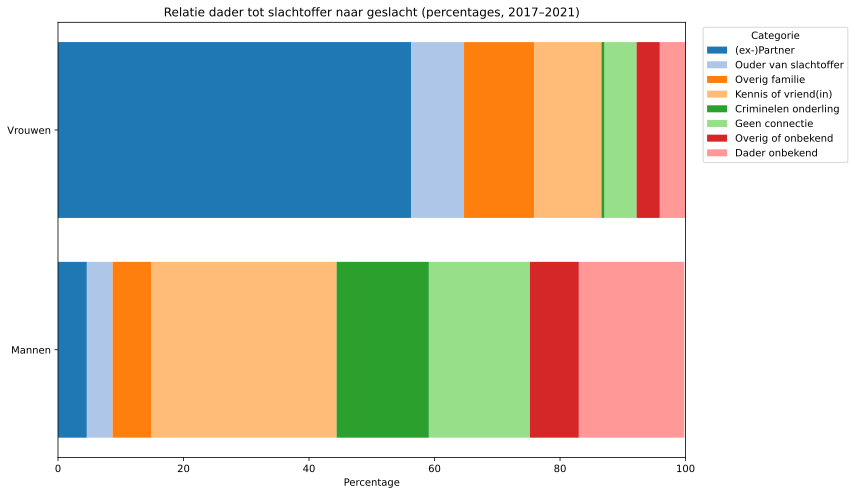
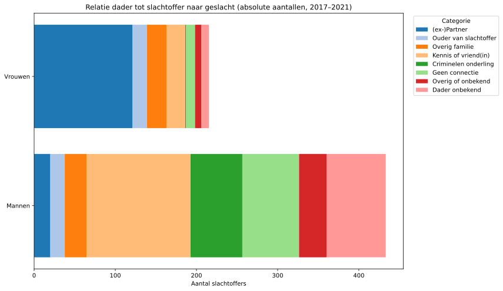

The Dutch government (OCW - Onderwijs, Cultuur en Wetenschap) has been making [this one chart](https://www.ocwincijfers.nl/sectoren/emancipatie/sociale-veiligheid/sociale-veiligheid) available, which bothers me.

Here is my version (using the same data) - the self-documented code can be found [here](./relative_code.py).

It shows the relations from the perpetrator to the victims in Dutch murder cases between 2017 and 2021. While the chart is informative and important around the current discussions regarding *femicide* (the killing of women because of their gender), it presents the data in relative terms (percentages), which can be misleading without the context of absolute numbers.

To better understand the situation, I decided to create a stacked bar chart that displays the *absolute* numbers of victims, separated by gender and relationship to the perpetrator as before. This allows for an improved comparison and highlights the scale of the issue more effectively.

What I did was to grab the data from the original chart (available under the first URL) and used ChatGPT to generate me the chart below - [self-documented code available as well](absolute_code.py)

This shows a slightly different story, as men get killed as often, if not more, by "Kennis of vriend(in)" than women do by their (ex-)partners.

Now here's the important difference between those numbers: The *supposed* reason why those men and women got killed. I say *supposed*, as I have not found any data on the ***reasons*** why people were killed. The theory is that the women were generally killed for being a woman (femicide), while the reasons the men were killed were more diverse (homicide - killing of a person who just happens to be a man, in this case).

---

I generated these charts to show the data in a more informative way, but I am not an expert in this field, nor do I have the complete context, as I'm missing the reasons for the killings.

To be continued, I guess.
