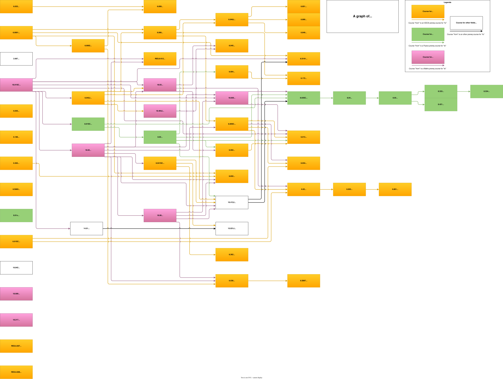

# MIT OCW Courses

Here is a graph of all MIT OCW courses that I could find.

The image is an SVG file created using [draw.io](https://www.drawio.com/) - [desktop version here](https://github.com/jgraph/drawio-desktop/releases). You can open the file in drawio if you want to edit it.

You can find a static list of [all courses here](./courses.md)

