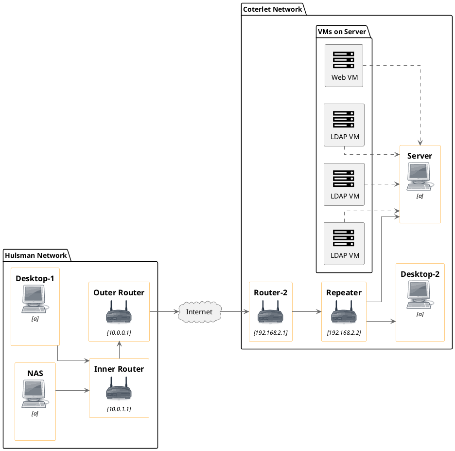

# network

```plantuml
@startuml
'────────── Standard-library includes ────────────────────────────
!include <osa2/all>
!include <tupadr3/common>
!include <tupadr3/font-awesome/server>

'────────── Layout & cosmetics ───────────────────────────────────
left to right direction
skinparam linetype  ortho
skinparam shadowing false
' title Sample topology – Hulsman & Coterlet networks
'──────────────────────────────────────────────────────────────────

'───────────────── Hulsman Network (LAN 1) ───────────────────────
package "Hulsman Network" {
    osa_desktop(desktop1,  "Desktop-1", "a", "")
    osa_desktop(nas,           "NAS", "a", "")
    osa_device_wireless_router(inner_router, "Inner Router", "10.0.1.1")
    osa_device_wireless_router(outer_router, "Outer Router", "10.0.0.1")

    desktop1 --> inner_router
    nas      --> inner_router
    inner_router -> outer_router
}

' '─────────────── Public WAN / Internet cloud ─────────────────────
cloud "Internet" as internet
' uplink from LAN 1
outer_router --> internet

' '───────────────── Coterlet Network (LAN 2) ──────────────────────
package "Coterlet Network" {
    osa_device_wireless_router(outer_router2, "Router-2", "192.168.2.1")
    osa_device_wireless_router(repeater, "Repeater" , "192.168.2.2")
    osa_desktop(server,                       "Server", "a", "")
    osa_desktop(desktop2,                    "Desktop-2", "a", "")

    outer_router2 --> repeater
    repeater     --> server
    repeater     --> desktop2

    ' Logical group of VMs hosted on “Server”
    package "VMs on Server" {
        FA_SERVER(vm_web1, "Web VM")
        FA_SERVER(vm_ldap, "LDAP VM")
        FA_SERVER(vm_pihole, "LDAP VM")
        FA_SERVER(vm_wireguard, "LDAP VM")
    }

    ' VM lives on the physical server
    vm_web1 ..> server
    vm_ldap ..> server
    vm_pihole ..> server
    vm_wireguard ..> server
}

' WAN link into LAN 2
internet --> outer_router2
@enduml
```
